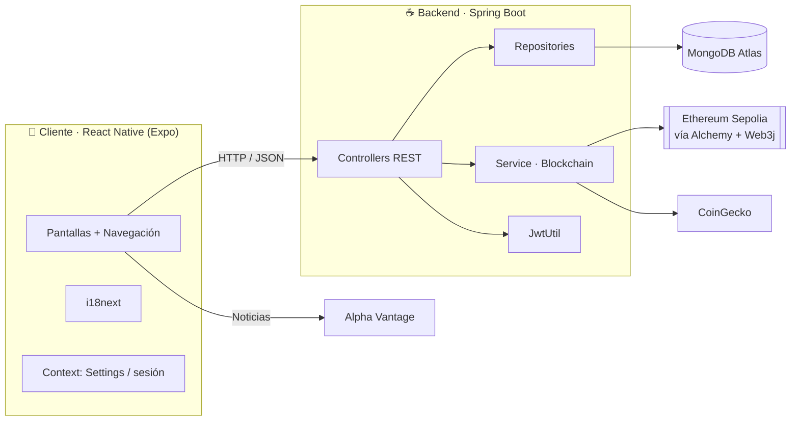
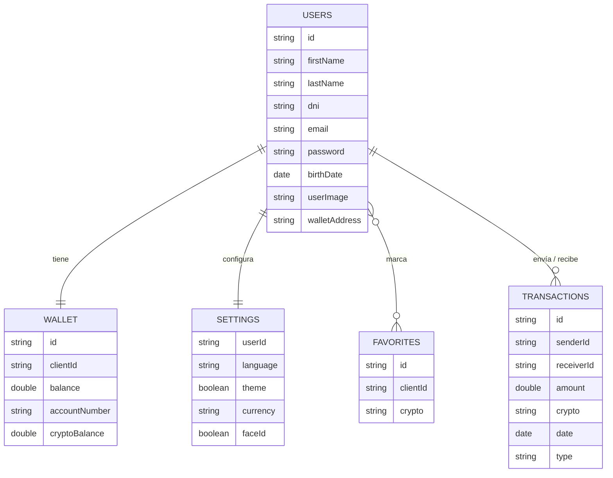

<div align="center">


# CryptoBit

**App multiplataforma de trading y billetera cripto sobre Ethereum (red de pruebas Sepolia)**

Registro seguro · Mercado en tiempo real · Billetera on-chain · Transferencias firmadas · Noticias con análisis de sentimiento


</div>

> **Proyecto Final del CFGS de Desarrollo de Aplicaciones Multiplataforma (DAM)** · Florida (Catarroja) · curso 2025/2026.
> Desarrollado en equipo con metodología **Scrum** (2 sprints, tablero en Trello).

---

## 📑 Índice

[Demo](#-demo) · [Características](#-características) · [Tecnologías](#️-tecnologías) · [Arquitectura](#️-arquitectura-del-proyecto) · [Seguridad](#-seguridad) · [APIs externas](#-apis--servicios-externos) · [i18n](#-internacionalización) · [Instalación](#-instalación-y-ejecución) · [Capturas](#-capturas) · [Autores](#-autor)

---

## 🎥 Demo

[▶️ **Ver vídeo de demostración**](https://drive.google.com/file/d/1l-d5U3CrYys-UXljOvjdn8WsXoJPT0Jy/view?usp=sharing)

> La aplicación funciona en **móvil (iOS/Android)** y en **web** con el mismo código (Expo + React Native Web), con layouts adaptados a pantalla de escritorio.

---

## ✨ Características

**Cuenta y acceso**
- Registro de usuario con aceptación obligatoria de Términos de Servicio y Política de Privacidad.
- Inicio de sesión con emisión de **token JWT** (caducidad de 30 minutos).
- **Face ID / biometría** mediante `expo-local-authentication`.
- Edición de perfil: datos personales, foto (redimensionada en el servidor), cambio de contraseña y **eliminación completa de la cuenta**.

**Mercado**
- Listado de criptomonedas con precio y variación a 24 h, sección *Trending* y filtros **All / Favorites / Gainers / Losers**.
- **Favoritos** persistentes por usuario.
- Buscador de monedas.

**Billetera**
- Saldo **real consultado en la blockchain** (Ethereum Sepolia) y valoración en fiat con el precio de mercado actual.
- Ocultación de saldo y listado de activos.

**Transacciones**
- **Envío de ETH firmado** con la clave del usuario y ejecutado on-chain con Web3j.
- Historial de movimientos **enviados y recibidos**, con buscador.

**Noticias**
- Feed de noticias económicas y financieras con **análisis de sentimiento** (optimista / neutral / bajista) y enlace al artículo original.

**Personalización**
- Modo claro / oscuro, idioma y divisa, persistidos por usuario en la base de datos.

---

## 🛠️ Tecnologías

| Capa | Tecnología |
|---|---|
| **Frontend** | React 19, React Native 0.81, Expo SDK 54, React Navigation 7 (stack, tabs), `expo-linear-gradient`, `@expo/vector-icons` |
| **Internacionalización** | `i18next` + `react-i18next` |
| **Seguridad cliente** | `crypto-js` (SHA-256), `expo-local-authentication` (Face ID) |
| **Backend** | Java 21, Spring Boot 3.2.2 (Spring Web, Spring Data MongoDB, Validation), Lombok |
| **Blockchain** | Web3j 4.10.0, nodo Ethereum Sepolia (Alchemy) |
| **Autenticación** | JJWT 0.11.5 (JWT HS256) |
| **Base de datos** | MongoDB Atlas |
| **Build / Deploy** | Maven, Expo EAS Build |
| **Herramientas** | IntelliJ IDEA, VS Code, Postman / Bruno, MongoDB Compass, Trello, Git/GitHub |

---

## 🏗️ Arquitectura del proyecto

Arquitectura **cliente–servidor desacoplada** con API **REST** propia. El backend actúa de intermediario entre la app, la base de datos, la blockchain y los proveedores de precios.



### Estructura de carpetas

```
CryptoBit/
├── back/                              # API REST (Spring Boot)
│   └── src/main/java/es/cryptobit/
│       ├── config/                    # CORS y bean de Web3j
│       ├── controller/                # User, Wallet, Favorite, Settings, Blockchain
│       ├── service/                   # BlockchainService (saldo, precios, transferencias)
│       ├── repository/                # Spring Data MongoDB
│       ├── model/                     # Documentos y DTOs
│       └── security/                  # JwtUtil
├── front/                             # App Expo / React Native
│   ├── assets/i18n/                   # Traducciones (es, ca, en, DE, FR, CH)
│   └── src/
│       ├── components/                # Barra de navegación inferior
│       ├── context/                   # Ajustes (tema, idioma, divisa, Face ID)
│       ├── screens/                   # inicioSesion, registroUsuario, menuPrincipal,
│       │                              # billetera, menuTransacciones, menuNoticias, perfilUsuario
│       └── styles/                    # Tema y estilos comunes
└── documentacion/                     # Memoria del proyecto, diagrama E-R (draw.io) y logo
```

### Modelo de datos (MongoDB)

Cinco colecciones: `users`, `wallet`, `favorites`, `settings` y `transactions`.



### Endpoints principales

| Módulo | Método y ruta | Descripción |
|---|---|---|
| **Usuarios** | `POST /API/NewUser` | Registro (devuelve `409` si el email ya existe) |
| | `POST /API/Login` | Login → devuelve `token` JWT y `userId` |
| | `GET /API/User/{id}` | Datos de un usuario |
| | `GET /API/UserIdByEmail?email=` | Resolver el id a partir del email |
| | `PUT /API/EditUser/{id}` | Editar perfil |
| | `DELETE /API/DeleteUser/{id}` | Eliminar cuenta y sus ajustes |
| **Favoritos** | `GET /API/SeeFavorites/{clientId}` | Favoritos del usuario |
| | `POST /API/NewFavorite` | Añadir favorito |
| | `DELETE /API/RemoveFavorite?clientId=&crypto=` | Quitar favorito |
| **Ajustes** | `GET /API/Settings/{userId}` | Leer ajustes |
| | `PUT /API/EditSettings/{userId}` | Guardar ajustes (*upsert*) |
| **Billetera** | `POST /API/NewWallet` · `PUT /API/EditWallet/{id}` · `DELETE /API/DeleteWallet/{id}` | Gestión de la cartera |
| **Blockchain** | `GET /api/blockchain/portfolio/{address}` | Saldo on-chain + valoración en EUR |
| | `POST /api/blockchain/Transfer` | Firma y envía una transferencia de ETH |
| | `GET /api/blockchain/MyTransactions/{userId}` | Historial enviado y recibido |

---

## 🔐 Seguridad

| Medida | Detalle |
|---|---|
| **Contraseñas sin texto plano** | La contraseña se transforma con **SHA-256** (`crypto-js`) antes de salir del dispositivo. |
| **Tokens JWT** | Emisión de tokens firmados (HS256) con **caducidad de 30 minutos**; el cliente los envía como `Authorization: Bearer`. |
| **Biometría** | Desbloqueo con **Face ID** (`expo-local-authentication`). |
| **Clave privada no persistida** | En las transferencias, la clave se usa solo para firmar: está marcada `@Transient` y **no se guarda en el historial** de transacciones. |
| **Red de pruebas** | Todas las operaciones se ejecutan en **Sepolia**: no se mueve dinero real. |
| **Errores genéricos en login** | El mensaje de fallo no revela si el email existe (evita enumeración de usuarios). |
| **Control de duplicados** | Email único en el registro (`409 Conflict`). |
| **Consentimiento legal** | Aceptación obligatoria de Términos y Política de Privacidad en el alta. |
| **Validación de imágenes** | La foto de perfil se decodifica y se reescala en el servidor. |

### 🧭 Mejoras de seguridad previstas

- Filtro de autenticación (Spring Security) que **valide el JWT en todos los endpoints** privados.
- Hash de contraseñas en servidor con **BCrypt / Argon2** (con sal) en lugar de SHA-256 sin sal.
- **Firmar las transacciones en el cliente** para que la clave privada nunca viaje al servidor.
- Secretos (Mongo, nodo Ethereum, clave JWT) **solo por variables de entorno**.
- **CORS restringido** a los orígenes de la app y límite de peticiones (*rate limiting*).

> ⚠️ Proyecto académico sobre red de pruebas. **No lo uses con fondos reales.**

---

## 🌐 APIs / servicios externos

| Servicio | Uso |
|---|---|
| **Alchemy (nodo Ethereum Sepolia)** | Consulta de saldos y difusión de transacciones firmadas (Web3j). |
| **CoinGecko** | Precios en EUR y variación a 24 h. Si la API cae, el backend usa valores por defecto para no romper la app. |
| **Alpha Vantage – `NEWS_SENTIMENT`** | Noticias económicas con puntuación de sentimiento. |
| **MongoDB Atlas** | Base de datos en la nube. |
| **API REST propia** | Usuarios, favoritos, ajustes, billetera y blockchain (ver [endpoints](#endpoints-principales)). |

---

## 🌍 Internacionalización

Interfaz preparada para **6 idiomas** con `i18next` + `react-i18next`:

🇪🇸 Español · 🏴 Català · 🇬🇧 English · 🇩🇪 Deutsch · 🇫🇷 Français · 🇨🇳 中文

- Las traducciones viven en `front/assets/i18n/<idioma>/<idioma>.json`, organizadas por pantalla (`login`, `register`, `home`, `wallet`, `transactions`, `news`, `profile`, `editProfile`, `nav`…).
- El idioma elegido se **guarda por usuario** (`settings.language`) y se aplica al iniciar sesión.
- Para añadir un idioma: crea su JSON, regístralo en `assets/i18n/index.js` y añade la opción en los ajustes.

---

## 🚀 Instalación y ejecución

### Requisitos

- **JDK 21** y **Maven 3.9+**
- **Node.js** (LTS reciente) y npm
- Cuenta en **MongoDB Atlas** (o un MongoDB local)
- Cuenta en **Alchemy** (o similar) con una app en **Ethereum Sepolia**
- Móvil con **Expo Go** o un emulador Android / iOS

### 1. Clonar

```bash
git clone https://github.com/<tu-usuario>/CryptoBit.git
cd CryptoBit
```

### 2. Backend

```bash
cd back
cp src/main/resources/application.properties.example src/main/resources/application.properties
# Edita el fichero con tu URI de MongoDB y la URL de tu nodo Sepolia

mvn spring-boot:run
```

La API queda disponible en **http://localhost:8080**.

> 🔒 No subas `application.properties` a Git: añádelo a `.gitignore`.

### 3. Frontend

```bash
cd front
npm install
npm install crypto-js
npx expo install expo-image-picker

# Apunta la app a tu backend (URL base de la API):
#   src/context/SettingsContext.js        → BASE_URL
#   src/screens/perfilUsuario/editarPerfil.js → API_BASE
# Usa la IP local de tu PC (p. ej. http://192.168.1.50:8080).
# En el emulador de Android: http://10.0.2.2:8080

npx expo start
```

Después pulsa **`w`** (web), **`a`** (Android), **`i`** (iOS) o escanea el QR con Expo Go.

### 4. Probar transferencias

1. Regístrate en la app y copia tu dirección de billetera Sepolia.
2. Consigue ETH de prueba en un *faucet* de Sepolia.
3. Crea un segundo usuario y envíale ETH desde **Transacciones → Send funds**.

### Compilar una versión instalable

```bash
cd front
npx eas build --platform android --profile preview
```

---

## 📸 Capturas

<table>
  <tr>
    <td align="center"><b>Inicio de sesión</b><br/></td>
    <td align="center"><b>Registro</b><br/></td>
  </tr>
</table>

**Mercado** — precios, *trending*, favoritos y filtros


**Billetera** — saldo real on-chain y activos


**Transacciones** — envío de fondos e historial


**Noticias** — feed con análisis de sentimiento


**Perfil y ajustes** — datos, tema, idioma, divisa y Face ID


---

## 🗺️ Roadmap

- [ ] Compra y venta de criptomonedas dentro de la app.
- [ ] Inicio de sesión con Google y con QR.
- [ ] Verificación de identidad (DNI) y de email.
- [ ] Endurecimiento de seguridad (ver [mejoras previstas](#-mejoras-de-seguridad-previstas)).
- [ ] Tests automatizados (JUnit / Jest) y CI con GitHub Actions.

---

## 👨‍💻 Autor

Proyecto realizado en equipo:

| | Rol |
|---|---|
| **Germán Antúnez Barcia** · [GitHub](https://github.com/<tu-usuario>) · [LinkedIn](https://www.linkedin.com/in/<tu-perfil>) | **Frontend**: app React Native / Expo, diseño de estilos y pantallas |
| **Carlos Fernández Bou** · [GitHub](https://github.com/<usuario-carlos>) | **Backend y despliegue**: API REST Spring Boot, MongoDB Atlas, integración blockchain · *Product Owner* |

---

<div align="center">

Hecho con ☕ y 💚 en Valencia · Proyecto académico, sin fines comerciales

</div>
